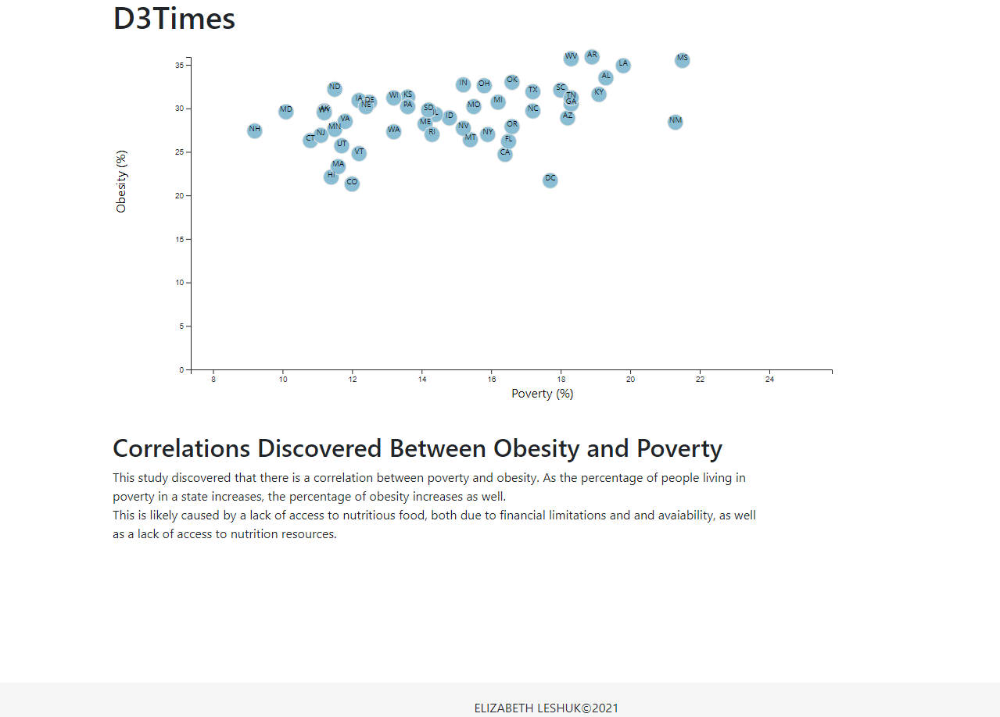

# D3-Challenge

**Task**:   
The editor wants to run a series of feature stories about the health risks facing particular demographics. She's counting on you to sniff out the first story idea by sifting through information from the U.S. Census Bureau and the Behavioral Risk Factor Surveillance System.

Using D3 techniques to complete this task, I created a scatter plot between two of the data variables, Poverty vs. Obesity. My plot represents each state with circle elements. I then added a section with my observations about the graph's trend.

